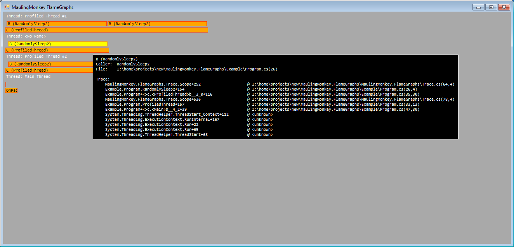

# MaulingMonkey's FlameGraphs

## TODO

- [x] Update hover boxes when main capture is paused
- [ ] Display time scales
- [ ] Add zoom in/out controls
- [ ] Better support threads which don't have a clear repeating root element
- [ ] Between frame sampling "persistence"
- [ ] Backport to support .NET 2.0 / VS2008
- [ ] Better styling
- [x] Refactor layout/input code into core lib
- [x] Controls cheat sheet (bind to F1 or '?')
- [x] Control mode display
- [ ] D3D9 / D3D11 overlays
- [ ] GDI non-form control
- [ ] Threshhold for full stack captures (e.g. only if duration > 100us)
- [ ] Good option for selectively or globally disabling tracing (e.g. ScopeIf(...), EnablesScopesIf(...))
- [ ] Keep hover tips in-window

## Screenshots

## License

MaulingMonkey's FlameGraphs is licensed under the [MIT license](LICENSE.txt).
